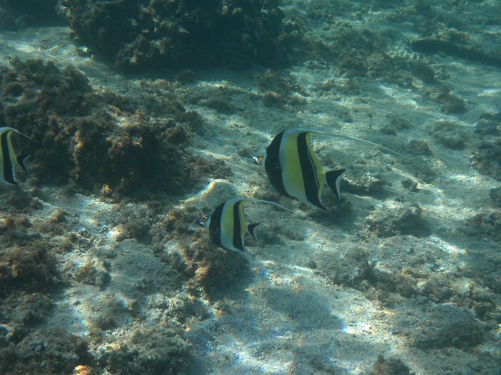

# Classification des poissons de la Réunion 🐠
À travers ce projet j'ai créé une application web qui va reconnaître les poissons du lagon de l'île de la Reunion. Le fonctionnement de l'application est simple. (a) L'utilisateur upload une photo de poisson. (b) Cette photo est transmise à l’algorithme de Deep Learning qui réalise une prédiction. (c) Cette prédiction est retournée à l'utilisateur

### **👉 [tester l'app](https://fish-classifier-reunion-island.herokuapp.com/)**

→ gif de l'app

Voici les différentes étapes mise en place afin de réaliser ce projet:

1. Collecter les données | [get_the_data.ipynb](https://colab.research.google.com/drive/1ybB06Y8hXg-3iuXqVMnTCBRF4LGhDJCQ?usp=sharing) 
2. Entraîner le modèle de classification | [modeling.ipynb](https://colab.research.google.com/drive/1UptvOjCSB7BK8Af8NTRGJJm8UPMfy51U?usp=sharing)
3. Créer et déployer une application web | [prototyping.ipynb](https://github.com/axelearning/fish_and_chips/blob/master/prototyping.ipynb)

## **Qu'est ce que j'ai appris ?**

- **Créer son propre dataset** en récupérant des photos depuis l'API d'un moteur de recherche, dans mon cas Bing search API
- **Utiliser un des modèles à la pointe de la technologie en deep learning** : [Resnet50](https://en.wikipedia.org/wiki/Residual_neural_network) et y appliquer du **transfert learning** pour permettre au modèle  de s'adapter à notre problème
- **Comprendre les erreurs du modèl**e et améliorer ces performances
- **Déployer une application de machine learning** avec Voila et Heroku

## **Pourquoi ce projet ?**
Dans un premier temps pour *développer mes compétences en intelligence artificielle* puis pour *passer plus de temps avec mon grand père*, fan de snorkeling, il passe beaucoup de temps à observer les poissons du lagon. Il m'a fait découvrir son monde (🐠) je lui est fait découvrir le mien (🤖)! 

Après lui avoir expliquer le projet on est parti recueillir des photos dans le lagon ensemble  afin de tester les performances du modèles sur des photos en production. En voici quelque une: 

